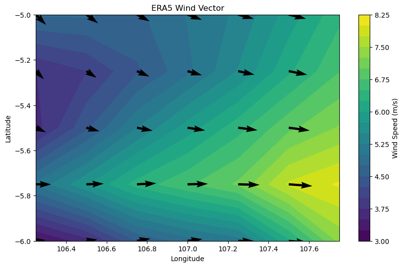

# ERA5 Wind Data Visualization

This project demonstrates how to download and visualize ERA5 wind data (u10 & v10) using Jupyter Notebook.

## Features

* Download ERA5 data via CDS API
* Load GRIB files using xarray
* Plot wind speed and direction
* Simple and reproducible workflow

---

## Requirements

Install dependencies using conda or pip:

```bash
conda install -c conda-forge xarray cfgrib cdsapi matplotlib numpy pandas
```

or

```bash
pip install xarray cfgrib cdsapi matplotlib numpy pandas
```

---

## CDS API Setup (IMPORTANT)

To download ERA5 data, you must register and configure the CDS API.

### 1. Create an account

Register at:
https://cds.climate.copernicus.eu/

---

### 2. Get your API key

After login, go to:
https://cds.climate.copernicus.eu/api-how-to

Copy your API credentials.

---

### 3. Create `.cdsapirc` file

Create a file in your home directory:

**Windows:**

```
C:\Users\YOUR_USERNAME\.cdsapirc
```

**Linux / Mac:**

```
~/.cdsapirc
```

Paste your credentials:

```
url: YOUR_https/api
key: YOUR_API_KEY
```

---

## Project Structure

```
pywind_era5_01/
│
├── era5_uv10_down_vis.ipynb
├── output/
│   └── plotwind.png
├── data/ (optional)
└── README.md
```

---

## How to Use

1. Clone Repository

Using Anaconda Prompt

```bash
git clone https://github.com/kikid-kbw/pywind_era5_01.git
cd pywind_era5_01
```
2. Run Jupyter Notebook
```bash
jupyter notebook
```

Then open:

```
era5_uv10_down_vis.ipynb
```
3. Execute Notebook
* Run all cells from top to bottom
* The script will:

  * Download ERA5 wind data (u10 & v10)
  * Load GRIB files
  * Generate wind visualization

---

## Output Example



---

## Notes

* ERA5 data is downloaded automatically from Copernicus Climate Data Store using CDS API
* Time selection can be adjusted using `TIME_INDEX`
* Visualization uses a combination of contour and vector plots
* Make sure internet connection is active during download

---

## Future Work

* Wind rose analysis
* Multi-year statistics
* Integration with coastal modeling tools

---

## Author

Created as part of a learning and knowledge-sharing initiative on ocean and coastal data analysis.
